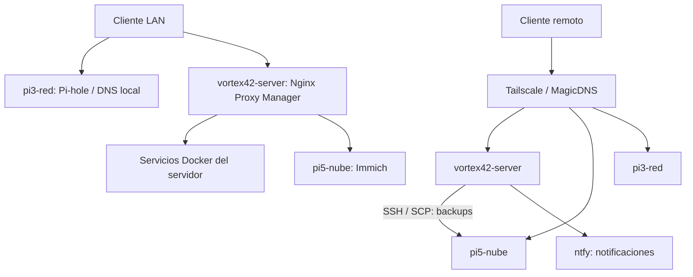

# Arquitectura

## Distribución

`vortex42-server` concentra las aplicaciones Docker y la administración. `pi5-nube` aloja Immich según la documentación histórica y recibe backups del servidor principal. `pi3-red` proporciona Pi-hole y funciones Tailscale de red según la documentación previa.

El diagrama representa relaciones documentadas y previstas por los enlaces existentes; no sustituye una exportación de reglas NPM ni una auditoría de conectividad. El acceso remoto a dominios LAN depende además de DNS y rutas, descritos en [Tailscale](networking/tailscale.md).

## Capas

| Capa | Componentes | Dependencias |
|---|---|---|
| Equipos y almacenamiento | Los tres hosts y sus discos | Energía, sistema operativo, montajes y espacio libre |
| Red | LAN, Pi-hole, Tailscale | Resolución, permisos, rutas y conectividad |
| Entrada web | Nginx Proxy Manager | DNS local, certificados y backends accesibles |
| Aplicaciones | Docker Compose por servicio | Docker, volúmenes y configuración privada |
| Observabilidad | Homepage, Uptime Kuma, Glances, Dozzle | Servicios consultados y credenciales de widgets |
| Protección de datos | Scripts, SSH/SCP, pi5-nube, ntfy | Origen sano, destino disponible y espacio |

## Dependencias que afectan una recuperación

- Si NPM falla, las aplicaciones pueden seguir ejecutándose aunque sus URL HTTPS no respondan.
- Si Pi-hole es el DNS efectivo de los clientes y cae, la resolución local puede fallar aunque las aplicaciones estén sanas.
- Si `pi5-nube` no está accesible por SSH, el backup general aborta su comprobación inicial antes de detener servicios.
- Si cae `vortex42-server`, también caen su monitoreo y ntfy. No hay evidencia de un observador externo que alerte esa caída.
- Immich y las copias del servidor comparten `pi5-nube`; no se conoce si usan discos independientes. No asumir aislamiento ante pérdida del host.
- Un archivo de configuración en Git no incluye automáticamente las bases de datos ni los volúmenes Docker.

## Límites de la arquitectura conocida

No están versionados el router, DHCP, firewall, reglas NPM, configuración interna de Pi-hole, política Tailscale, almacenamiento de las Raspberry Pi ni una copia externa. Tampoco se documenta un clúster, un orquestador o alta disponibilidad de aplicaciones. Los archivos de ejemplo de Kubernetes y Proxmox de Homepage no prueban que esas plataformas estén desplegadas.
